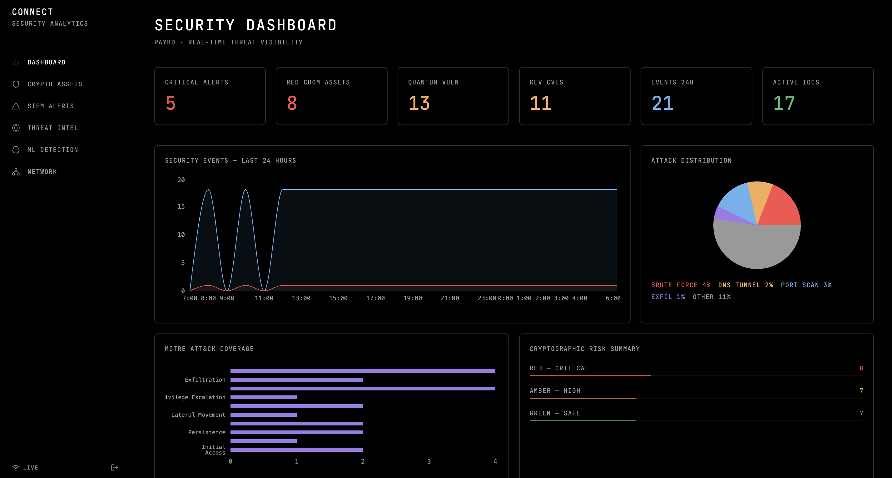
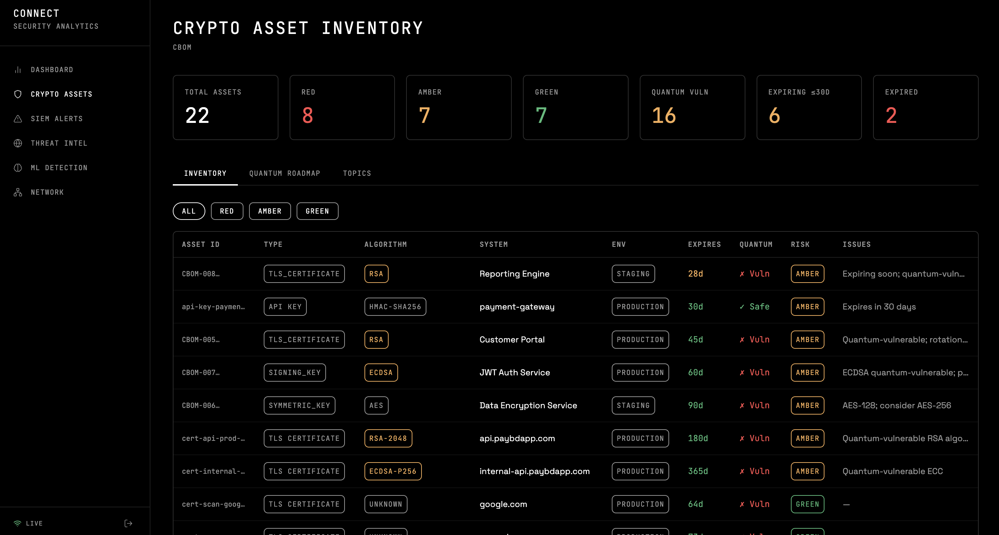
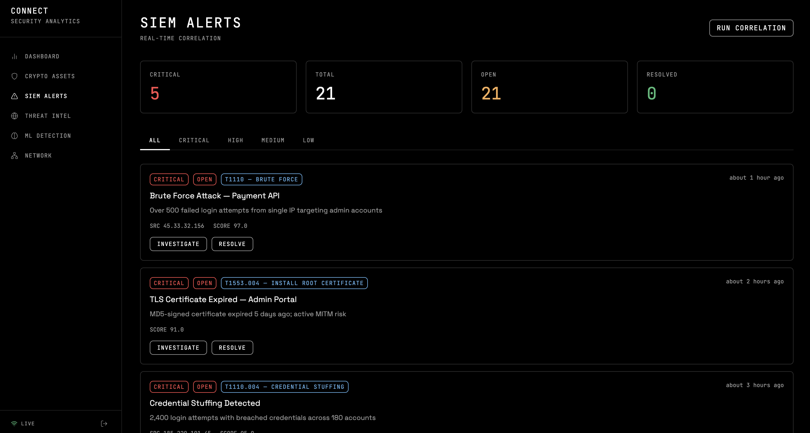
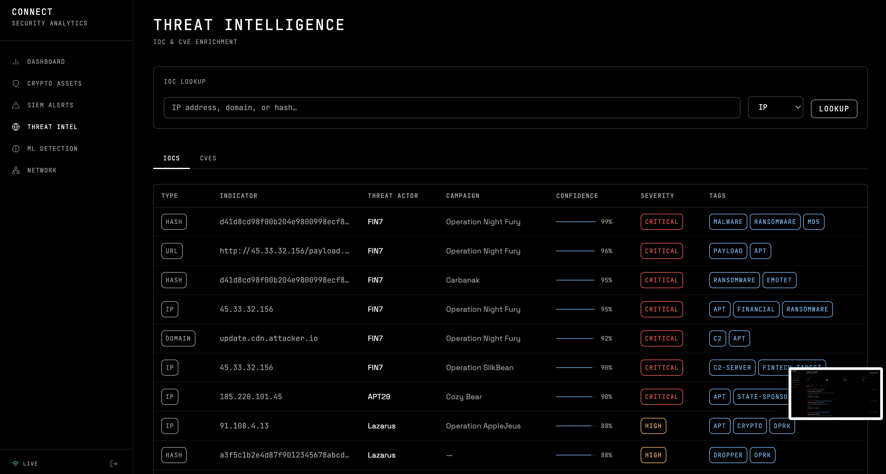
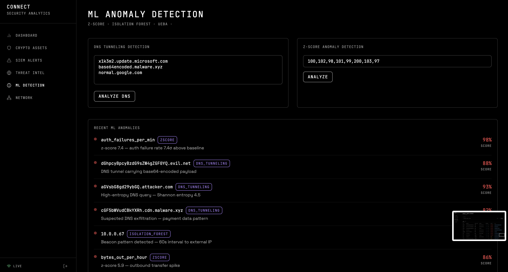
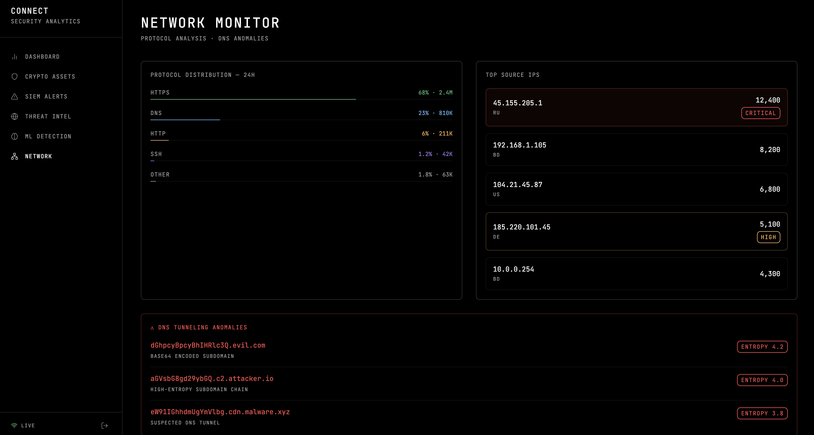

# 🔐 Connect Security Analytics Platform

> A full-stack cryptographic risk management and real-time security analytics platform.
> Built with Node.js · PostgreSQL · Elasticsearch · React · Docker

---

## 🧩 Problem Statement

**PayBD** — a Bangladeshi fintech company — processes 50,000 payments daily.
They face three critical problems:

1. **No visibility** into whether their encryption is healthy (expired certs, weak algorithms, orphaned keys)
2. **No real-time detection** of attacks (brute force, credential stuffing, data exfiltration)
3. **No behavioral intelligence** — unknown attacks and insider threats go undetected

---

## 📸 Screenshots

### Dashboard
> Summary stats, 24h event timeline, attack distribution, MITRE ATT&CK coverage



### CBOM — Cryptographic Bill of Materials
> Crypto asset inventory, risk ratings (Red/Amber/Green), quantum-vulnerability detection



### Alerts — SIEM
> Real-time alert feed with Socket.IO push, severity filtering, MITRE tactic tagging



### Threat Intelligence
> IOC database, CVE tracking with CVSS/EPSS scores, CISA KEV flag



### ML Anomaly Detection
> Z-score and Isolation Forest anomaly scores, DNS tunneling entropy analysis



### Network Monitor
> Protocol distribution, top source IPs, DNS tunneling anomalies



---

## 🏗️ Architecture

```
┌─────────────────────────────────────────────────────┐
│                  React Dashboard                     │
│         (CBOM · SIEM · Alerts · ML Scores)          │
└──────────────────────┬──────────────────────────────┘
                       │ REST API + WebSocket
┌──────────────────────▼──────────────────────────────┐
│              Node.js API Server                      │
│   Express · JWT Auth · Crypto Service · ML Engine   │
└────────┬──────────────────────────┬─────────────────┘
         │                          │
┌────────▼────────┐      ┌──────────▼──────────────┐
│   PostgreSQL    │      │      Elasticsearch        │
│  Users · Keys  │      │  Logs · CBOM · Alerts     │
│  Audit Logs    │      │  ML Results · Threat Intel │
└─────────────────┘      └──────────────────────────┘
                                   ▲
                         ┌─────────┴──────────┐
                         │      Logstash       │
                         │  Parse · Normalize  │
                         │  Enrich · Index     │
                         └─────────▲──────────┘
                                   │
              ┌────────────────────┼──────────────┐
              │                    │              │
        App Logs            Firewall Logs    System Logs
```
## What This Project Does
The Connect Security Analytics Platform is a high-performance, enterprise-grade Security Operations Center (SOC) backend backend designed to seamlessly aggregate, analyze, and correlate complex telemetry. Built on a modernized Node.js and PostgreSQL architecture integrated deeply with the Elasticsearch (ELK) stack, the platform processes systemic logs to actively identify and mitigate cyber threats. 

It specializes in bridging traditional signature-based alerting with advanced Machine Learning User and Entity Behavior Analytics (UEBA), while simultaneously offering niche capabilities like proactive Cryptographic Bill of Materials (CBOM) management to prepare infrastructures for the post-quantum cryptography computing era.

## Feature Listing
1. **Identity & Access Management (IAM):** Stateless but fiercely protected role-based access control utilizing signed JSON Web Tokens (JWT), robust password hashing (`bcrypt`), and strict rate limiting.
2. **Cryptographic Bill of Materials (CBOM):** Dynamic inventorying and risk assessment of deployed certificates and keys, generating prioritized roadmaps against quantum-vulnerable configurations. 
3. **SIEM & Alerting Engine:** Highly scalable log correlation natively offloading aggregation math to Elasticsearch to generate actionable Mitre ATT&CK mapped incidents in real-time.
4. **Threat Intelligence Lifecycle:** Continuous intersection of live network data against internally managed Indicators of Compromise (IOCs) and prioritized CVE tracking based on real-world exploitability (EPSS/CISA KEV).
5. **Machine Learning & UEBA:** Behavioral profiling and statistical thresholding (Isolation Forest, Z-Score) engineered to spot anomalies like DNS tunneling exfiltration or compromised insider threats without relying on fixed rules.
6. **Network Intrusion Monitoring:** Fast aggregation of firewall logs, DNS queries, and TCP/UDP communication mapped directly to geographic locations.
7. **Observability & Platform Audit:** Complete zero-latency compliance recording via asynchronous middleware, alongside thorough application error tracing piped straight into customized system health dashboards.

## Future Improvements Roadmap
To continuously evolve the platform into a best-in-class security ecosystem, the following enhancements are planned:

- **Authentication Enhancements:** Implementation of Multi-Factor Authentication (MFA), secure `HttpOnly` refresh token cycling, and enterprise SAML/OIDC federated SSO capabilities.
- **Automated Remediation (SOAR):** Development of execution playbooks allowing the platform to automatically issue firewall block commands or IAM account suspensions upon severe threshold breaches.
- **Advanced Threat Feed Ingestion:** Full support for automated, real-time STIX/TAXII threat feed ingestion and automated indicator relevance decay.
- **Graph-Based Threat Actor Mapping:** Linking disparate IOCs directly to specific Advanced Persistent Threat (APT) groups using graph analytics.
- **Deep Network Inspection:** Introduction of JA3/JA4 TLS interaction fingerprinting to identify encrypted malware traffic, and native AWS VPC/GCP Flow Log ingestion templates.
- **Advanced Applied ML:** Implementation of Peer-Group UEBA analysis (comparing users to their department baselines) and automated feedback loops for retraining models on "False Positive" determinations.
- **Enterprise Hardware & Governance:** Native integrations into physical Hardware Security Modules (HSM) for cryptography, OpenTelemetry for microservice tracing, and immutable AWS S3 WORM storage for permanent audit compliance.

---

## 🚀 Quick Start

### Prerequisites
- Docker & Docker Compose
- Node.js 20+
- Git

### 1. Clone and Setup
```bash
git clone <repo>
cd connect-security
cp backend/.env.example backend/.env
```

### 2. Start Everything
```bash
docker-compose up -d
```

### 3. Initialize Database
```bash
cd backend
npm install
npm run db:migrate
npm run db:seed
```

### 4. Start Backend
```bash
npm run dev
```

### 5. Start Frontend
```bash
cd frontend
npm install
npm run dev
```

### 6. Access
- **Dashboard**: http://localhost:3000
- **API**: http://localhost:4000
- **Kibana**: http://localhost:5601
- **Elasticsearch**: http://localhost:9200

---

## 📁 Project Structure

```
connect-security/
├── backend/
│   ├── src/
│   │   ├── routes/
│   │   │   ├── auth.js          # JWT authentication
│   │   │   ├── cbom.js          # Crypto asset inventory
│   │   │   ├── alerts.js        # SIEM alerts
│   │   │   ├── threatIntel.js   # IOC + CVE tracking
│   │   │   └── ml.js            # Anomaly detection
│   │   ├── services/
│   │   │   ├── cryptoService.js     # AES-256-GCM encryption
│   │   │   ├── elasticService.js    # Elasticsearch client
│   │   │   ├── cbomService.js       # CBOM assessment engine
│   │   │   ├── mlService.js         # Isolation Forest + Z-score
│   │   │   └── threatIntelService.js # IOC enrichment
│   │   ├── middleware/
│   │   │   ├── auth.js          # JWT verification
│   │   │   └── audit.js         # Audit log every request
│   │   └── jobs/
│   │       ├── certScanner.js   # TLS certificate scanner
│   │       └── keyRotation.js   # Automated key rotation
│   ├── config/
│   │   └── database.js
│   ├── migrations/
│   └── .env.example
├── frontend/
│   └── src/
│       ├── pages/
│       │   ├── Dashboard.jsx    # Main overview
│       │   ├── CBOM.jsx         # Crypto asset inventory
│       │   ├── Alerts.jsx       # SIEM alert feed
│       │   ├── ThreatIntel.jsx  # IOC + threat feeds
│       │   └── ML.jsx           # Anomaly detection
│       └── components/
├── elk/
│   ├── logstash/pipeline/
│   │   └── security.conf        # Log parsing pipeline
│   └── kibana/
├── docker-compose.yml
└── README.md
```

---

## 🧪 Test the System

```bash
# Simulate a brute force attack
npm run simulate:bruteforce

# Simulate DNS tunneling
npm run simulate:dnstunnel

# Simulate data exfiltration
npm run simulate:exfil

# Run ML detection
npm run ml:detect
```

---

